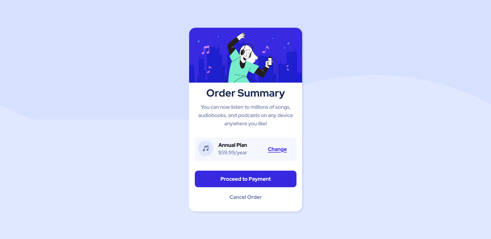
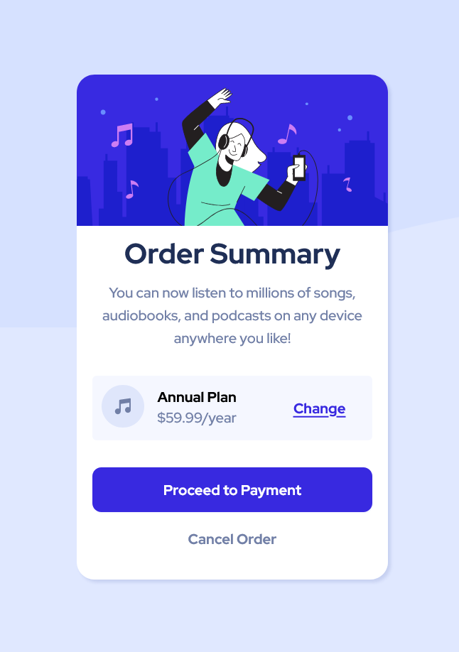

# Frontend Mentor - Order summary card solution

This is a solution to the [Order summary card challenge on Frontend Mentor](https://www.frontendmentor.io/challenges/order-summary-component-QlPmajDUj).

## Table of contents

- [Overview](#overview)
  - [The challenge](#the-challenge)
  - [How to Use](#how-to-use)
  - [Screenshot](#screenshot)
  - [Links](#links)
  - [Built with](#built-with)
  - [What I learned](#what-i-learned)
  - [Continued development](#continued-development)
  - [Useful resources](#useful-resources)
- [Author](#author)
- [Acknowledgments](#acknowledgments)


## Overview
Order Summary Card Challenge by Frontend Mentor.

### The challenge

The challenge is to build out the Order summary component and get it looking as close to the design (provided) as possible.

### How to Use

Users should be able to: Use the Order summary component: 

- Clone the repository in any editor ( I recommend Visual Studio Code) or just download the zip file of code by clicking on Green colored code button.
- Extract the file and open it on your editor by allowing all the requirements.
- Now open the  index.html  and edit it or add details as you want for your project, and if you want to editing some styling so open styles.css file.

Happy development.  


### Screenshot
- Here is the screenshots of the profile card component that I have created, just follow the link below.





### Links

- Solution URL: [Solution URL ](https://harsha094.github.io/Order-Summary-Component/)
- Live Site URL: [Order Summary Component](https://harsha094.github.io/Order-Summary-Component/)

### Built with

- Semantic HTML5 markup
- CSS custom properties
- Flexbox
- CSS Grid


### What I learned

I Choose this project to test my knowledge of HTML and CSS especially different CSS properties like border, padding, flex, grid etc.

Some Code snippets of the concept that i follow to build Order summary component, see below:

```html
<div class="card-footer">
  <article class="first-item">
    <div class="music_icon"></div>
      <div class="pricing">
        <h4>Annual Plan</h4>
          <p>$59.99/year</p>
      </div>
  </article>
  <button class="btn btn-change">Change</button>
</div>
```
```css
.card{
  width: 350px;
  border-radius: 20px;
  background: white;
  overflow: hidden;
  box-shadow: 3px 3px 3px hsl(228, 45%, 44%, 0.15);
  text-align: center;
  position: relative;
  padding-bottom: 20px;    
}
```

### Continued development

I want to continue focusing on my path to a full stack web developer, i already completed HTML/CSS and JavaScript functionalities and now i'm focusing on remaining onces(React.js, Node.js, Dapps, APIs and Database).

### Useful resources

- [freecodecamp](https://www.freecodecamp.org) - This helped me in using css properties like flex, animation etc. I really liked this platform and will use it going forward.
- [w3schools](https://www.w3schools.com/css/) - This is an amazing website which helped me finally understand z-index and shadows in CSS. I'd recommend it to anyone still learning this concept.

## Author

- Website - [Harsh Raghuwanshi](https://harsha094.github.io/personal-website/)
- Frontend Mentor - [@harsha94](https://www.frontendmentor.io/profile/harsha094)
- Twitter - [@HarshRa19107484](https://www.twitter.com/HarshRa19107484)


## Acknowledgments

I am very thankful of [tsbsankara](https://www.youtube.com/c/tsbsankara) for helping me in this project.
and also thankful of [Dr. Angela Yu](https://twitter.com/yu_angela) for intoducing me about the Frontend Mentor.
